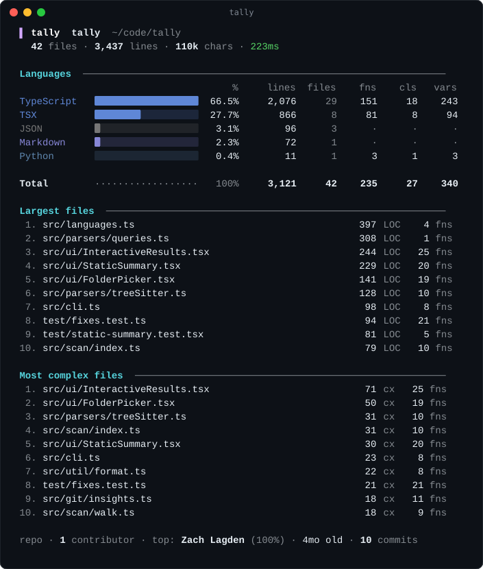

# tally

<div align="center">


**Code statistics for your terminal. Lines, comments, functions, classes and
complexity across 37 languages, counted from a real parse.**

[Features](#features) • [Installation](#installation) • [Usage](#usage) •
[Languages](#languages) • [Performance](#performance) • [FAQ](#faq)

<br />



</div>

## What does this tool do?

1. **Lists** the files in a folder. Inside a git repo it asks `git ls-files`, so `.gitignore` is respected.
2. **Skips** what isn't source: binaries, lockfiles, minified bundles, `node_modules`, `dist`, caches and virtualenvs.
3. **Classifies** each file by extension, filename (`Dockerfile`, `Makefile`) or shebang line.
4. **Counts** total, code, comment and blank lines using each language's comment syntax.
5. **Parses** source with [tree-sitter](https://tree-sitter.github.io/) to count functions, classes, variables and branches.
6. **Reports** a per-language breakdown, the largest and most complex files, and git history, as a terminal summary, an interactive TUI, JSON or CSV.

## Features

- **Symbol counts from a parser.** Functions, classes and variables come from tree-sitter syntax trees, not line-matching regexes. A handful of long-tail languages use regex fallbacks.
- **Interactive TUI.** Run `tally` with no arguments to pick a folder, then browse languages and files, drill in, and re-sort by any column.
- **JSON and CSV output** for scripts, dashboards and CI.
- **Parallel parsing.** Large repos are parsed on a pool of worker threads. Small ones stay on one thread, where thread start-up would cost more than it saves.
- **Git insights.** Contributor count, top contributor, repo age and commit count, all read from `HEAD`.
- **No native build.** Grammars ship as WebAssembly, so installing needs no compiler toolchain.
- **Nothing hidden.** Files that exist but can't be read are listed in the JSON output and counted in the summary.

## Installation

Requires [Node.js](https://nodejs.org/) 22 or newer and [pnpm](https://pnpm.io/).

tally isn't on npm yet. Install it from source:

```bash
git clone https://github.com/zachlagden/tally
cd tally
pnpm install
pnpm build
pnpm link --global
```

`pnpm link --global` points the `tally` command at your clone. If you move the folder, run it again from the new location.

## Usage

```bash
tally                  # interactive: pick a folder, then browse the results
tally .                # one-shot summary of the current folder
tally ./src            # scan a subfolder (inside a repo, .gitignore still applies)
tally . --json         # JSON to stdout, no colour codes
tally . --csv          # one CSV row per language
tally . --no-symbols   # line counts only, skips parsing
tally . -i             # interactive TUI for a given path
```

### Options

| Option | Description |
| --- | --- |
| `-i, --interactive` | Open the interactive TUI even when a path is given |
| `--json` | Print JSON to stdout |
| `--csv` | Print per-language CSV to stdout |
| `--no-symbols` | Count lines only and skip tree-sitter parsing |
| `--no-git` | Skip git insights |
| `--top <n>` | Rows in the largest and most complex file lists (default 10) |
| `--lang <ids>` | Only count these languages, e.g. `--lang typescript,tsx`. An unknown id prints the valid ones |
| `--threads <n>` | Worker threads for parsing. `0` runs on one thread. The default depends on repo size and CPU count |
| `--parse-timeout <seconds>` | Give up on one file's symbols after this long (default 60). Its lines are still counted and it's listed in `symbolTimeouts`. Applies when parsing on worker threads |
| `-V, --version` | Print the version |

### Interactive TUI keys

| Key | Action |
| --- | --- |
| `↑` `↓` / `j` `k` | Move |
| `enter` / `→` / `l` | Open the selected language, or pick the folder |
| `←` / `h` / `esc` | Back |
| `s` | Cycle the sort column |
| `r` | Reverse the sort |
| `g` / `G` | Jump to top / bottom |
| `q` | Quit |

### JSON output

Run on this repo, `--json` prints totals, one entry per language, the largest and most complex files, any files that couldn't be read, and git insights:

```json
{
  "fileCount": 42,
  "totalLines": 3437,
  "languages": [
    { "id": "typescript", "files": 29, "codeLines": 2076, "commentLines": 1, "functions": 151, "classes": 18, "complexity": 314 }
  ],
  "largestFiles": [{ "path": "src/languages.ts", "codeLines": 397, "functions": 4 }],
  "skippedFiles": [],
  "git": { "contributors": 1, "commitCount": 10, "firstCommitDate": "2026-05-20T12:09:59+01:00" }
}
```

Fields are trimmed here. Files over 1 MB are still line-counted but skip symbol parsing, and carry `"symbolsSkipped": true`. So do files whose parse runs past `--parse-timeout`; those are also listed in `symbolTimeouts`.

## Languages

**Parsed with tree-sitter** (functions, classes, variables, complexity):
TypeScript, TSX, JavaScript, Python, Go, Rust, Java, C, C++, C#, Ruby, PHP, Swift, Kotlin, Scala, Dart, Lua, Elixir, OCaml, Elm, Solidity, Zig, Shell, and Vue (its `<script>` block, with the JavaScript or TypeScript grammar).

**Parsed with regex fallbacks:** Haskell, SQL, R, Perl, SCSS.

**Line counts only:** JSON, YAML, TOML, HTML, CSS, Markdown, Dockerfile, Makefile.

Every language has a fixture in [`test/fixtures/languages`](test/fixtures/languages) with hand-checked line and symbol counts, and CI fails if any of them drift.

Complexity is a cyclomatic-style score: one per function plus one per branch (`if`, loops, `case`, `catch`, ternaries).

## Performance

Measured on an Intel i7-10750H (6 cores, 12 threads) under WSL2 with Node 22. Each repo is a shallow clone at the tag shown, scanned with `--json --no-git` one at a time. Times are the median of three runs; `--no-symbols` is a single run.

| Repository | Main language | Files | Lines | Functions | Time | `--no-symbols` | Peak memory |
| --- | --- | --: | --: | --: | --: | --: | --: |
| [django/django](https://github.com/django/django) 6.1.1 | Python | 3,469 | 545k | 33,725 | 2.0 s | 1.0 s | 391 MB |
| [rails/rails](https://github.com/rails/rails) 8.1.3.1 | Ruby | 3,883 | 638k | 76,717 | 2.2 s | 1.0 s | 460 MB |
| [ppy/osu](https://github.com/ppy/osu) 2026.921.0 | C# | 4,968 | 600k | 54,535 | 2.9 s | 1.2 s | 539 MB |
| [facebook/react](https://github.com/facebook/react) 19.3.0 | JavaScript | 6,959 | 1.0M | 51,486 | 3.2 s | 1.4 s | 525 MB |
| [microsoft/vscode](https://github.com/microsoft/vscode) 1.139.0 | TypeScript | 16,527 | 5.3M | 304,551 | 12.5 s | 2.1 s | 864 MB |
| [kubernetes/kubernetes](https://github.com/kubernetes/kubernetes) 1.37.1 | Go | 21,662 | 5.4M | 157,963 | 12.3 s | 4.5 s | 681 MB |
| [rust-lang/rust](https://github.com/rust-lang/rust) 1.98.1 | Rust | 39,372 | 4.9M | 222,351 | 16.3 s | 4.2 s | 793 MB |
| [torvalds/linux](https://github.com/torvalds/linux) 7.3-rc4 | C | 76,747 | 39.6M | 792,701 | 93 s | 9.9 s | 1.1 GB |

Every scan finished with no skipped files and no parse timeouts. Parsing is most of the cost: `--no-symbols` is 2 to 9 times faster. Linux, with 1.5 GB of source, ranged from 74 s to 107 s across its three runs.

`tally --version` starts in about 70 ms because the TUI libraries only load when something is drawn.

## How it works

1. Inside a git repo, files come from `git ls-files -co --exclude-standard`. Elsewhere, [tinyglobby](https://github.com/SuperchupuDev/tinyglobby) walks the tree, and ignored directories are filtered by name.
2. Files are sorted by language and handed out in batches, so each worker thread loads only the grammars it needs.
3. Each worker reads a file, counts its lines, and runs a tree-sitter query that tags functions, classes, variables and branches.
4. The main thread aggregates the results while `git shortlog` and `git rev-list` run in parallel.
5. Grammars are WebAssembly builds from each language's official npm package, vendored in [`grammars/`](grammars) with their licences. `node scripts/update-grammars.mjs` rebuilds the folder from the pinned versions in `grammars/manifest.json`.
6. Scans of up to 1,000 files run the grammars on V8's baseline compiler (Liftoff), which starts fast. Larger scans use the optimising compiler (TurboFan), which costs a few seconds to warm up and then parses 25 to 40% faster. Set `TALLY_WASM_TIER=liftoff` or `turbofan` to force one.
7. If one file takes longer than `--parse-timeout` to parse, its worker is replaced and the file is line-counted without symbols, so a pathological file can't stall the scan.

## FAQ

<details>
<summary><b>How is this different from cloc or tokei?</b></summary>

cloc and tokei count lines: code, comments and blanks. tally counts those too, then parses each file to count functions, classes and variables and to score complexity. It also has an interactive TUI and lists the largest and most complex files. If you only want line counts, `--no-symbols` skips the parse.
</details>

<details>
<summary><b>Why is a file missing from the results?</b></summary>

- It's ignored by `.gitignore`, or it lives in a skipped directory such as `node_modules`, `dist`, `vendor` or `.venv`.
- It's a lockfile (`pnpm-lock.yaml`, `package-lock.json`, `Cargo.lock`, `go.sum` and others).
- It's binary or minified, or its extension isn't one tally knows.
- It couldn't be read. Check `skippedFiles` in `--json` output for the reason.
</details>

<details>
<summary><b>Why do some languages show no functions?</b></summary>

JSON, YAML, TOML, HTML, CSS, Markdown, Dockerfiles and Makefiles have none to count, so tally only counts their lines.
</details>

<details>
<summary><b>Can I use it in CI?</b></summary>

Yes. `tally . --json` prints no colour codes and exits cleanly when piped into `head` or `jq`. Add `--no-git` on shallow clones, where commit counts are incomplete.
</details>

## Development

```bash
pnpm install
pnpm dev          # rebuild on save and run
pnpm test         # build, then run the test suite
pnpm typecheck
```

The CLI tests run against `dist/`, so `pnpm test` builds first.

### Testing

- **Unit and CLI tests** run on Linux, macOS and Windows against Node 22 and 24.
- **Language fixtures.** One small program per supported language, with every line tagged by hand as code, comment or blank, and the expected function, class and variable counts. Known gaps are marked with `test.fails`, so fixing one turns the suite red until the marker is removed.
- **Smoke tests** run tally on pinned releases of Flask, Express, Gin, ripgrep, Gson and Sinatra. Each checks the top language, that symbols were found, that nothing was skipped, and that single-threaded and worker-pool runs produce identical JSON.

Run a smoke test locally with `node scripts/smoke.mjs <repo-dir> <language-id>` after `pnpm build`.

## Star history

<a href="https://github.com/zachlagden/tally/stargazers">
 <picture>
   <source media="(prefers-color-scheme: dark)" srcset="https://repo-star-history.zachlagden.uk/svg?repos=zachlagden/tally&type=Date&theme=dark&legend=top-left&format=png" />
   <source media="(prefers-color-scheme: light)" srcset="https://repo-star-history.zachlagden.uk/svg?repos=zachlagden/tally&type=Date&legend=top-left&format=png" />
   
 </picture>
</a>

## License

MIT License. See [LICENSE](LICENSE) for details.
